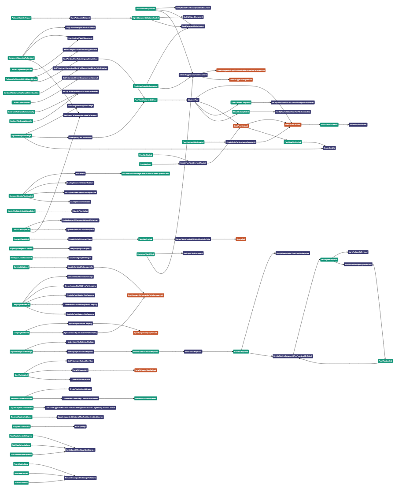

# Laravel Event Visualizer

[](https://packagist.org/packages/jonaspardon/laravel-event-visualizer)
[](https://github.com/jonaspardon/laravel-event-visualizer/actions?query=workflow%3Arun-tests+branch%3Amain)
[](https://github.com/jonaspardon/laravel-event-visualizer/actions?query=workflow%3A"Check+%26+fix+styling"+branch%3Amain)
[](https://packagist.org/packages/jonaspardon/laravel-event-visualizer)

Laravel package to visualize events with their handlers, including jobs to chain them together.



## Installation

You will need PHP 8.1 or higher.

Install the package via composer:

```bash
composer require jonaspardon/laravel-event-visualizer --dev
```

Publish the config file with:

```bash
php artisan vendor:publish --tag="event-visualizer-config"
```

Publish the views with:

```bash
php artisan vendor:publish --tag="event-visualizer-views"
```

## Usage

Visit `your-app.test/event-visualizer` on a non-production environment.

## How does it work?

The starting point is your registered app events and their listeners/subscribers as defined in your `EventServiceProvider`.

For each of those listeners/subscribers, the package will try to find the dispatched events and jobs by parsing the code and traversing through the abstract syntax tree. 
For every event/job found, the same AST traversal will be done recursively until it reaches the end.

## Supported

| Syntax                                                           | Supported? |
|------------------------------------------------------------------|------------|
| `\Event` facade static call                                      | ✅          |
| `\Bus` facade static call                                        | ✅          |
| `\Illuminate\Support\Facades\Event` facade static call           | ✅          |
| `\Illuminate\Support\Facades\Bus` facade static call             | ✅          |
| `\Illuminate\Contracts\Events\Dispatcher` injected variable call | ✅          |
| `\Illuminate\Contracts\Bus\Dispatcher` injected variable call    | ✅          |
| `event(...)` helper                                              | ✅          |
| `dispatch(...)` helper                                           | ✅          |
| Bus chains                                                       | ❌          |

For dependency injection, both constructor and method injection are supported.

Inline instantiation of classes is supported.

Passing variables (`Event::dispatch($event)` as opposed to `Event::dispatch(new EventName())`) is supported, but there might be some edge cases where it fails. If you encounter these, please open an issue and provide a code sample.

## Testing

```bash
composer test
```

## Contributing

Contributions are welcome. 

When sending in a PR, please make sure to add/modify tests for the code you touch.

## License

The MIT License (MIT). Please see [License File](LICENSE.md) for more information.
